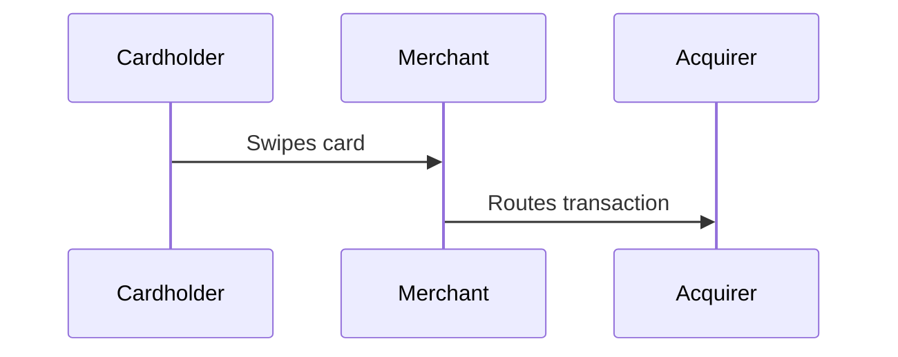

<div align="center">

# FinTech Foundations

**Interactive financial education platform — from beginner to expert.**

[]()
[]()
[]()

</div>

## What Is This?

FinTech Foundations is a full-stack fintech education platform that teaches modern financial technology through 15 modules spanning beginner to expert levels. Each module combines text lessons, interactive quizzes, simulations, and games.

### Platform Highlights

- **15 modules** covering banking, payments, credit, stocks, insurance, crypto, DeFi, regulatory compliance, AI in finance, and embedded finance
- **5 interactive games**: Stock Trading Simulator, Underwriting Game, Parametric Insurance, Fraud Detection, "Who Wants to Be a Millionaire" Pop Quiz
- **Quantitative finance**: Black-Scholes options pricing, MPT portfolio optimization, risk analytics (Sharpe, Sortino, VaR)
- **Gamified learning**: XP, levels, badges, streaks, progress tracking
- **Interactive diagrams**: KaTeX math rendering, Mermaid sequence diagrams, React Flow architecture diagrams, Markmap mind maps
- **136+ unit and integration tests** across 11 test files

## Quick Start

```bash
npm install
npm run dev
```

Visit `http://localhost:3000` — the app includes a fully functional Express backend with API endpoints, a file-backed JSON database, and a Vite dev server.

## Commands

| Command | Purpose |
|---------|---------|
| `npm run dev` | Start dev server (Express + Vite HMR) |
| `npm run build` | Production build (Vite frontend + esbuild server) |
| `npm run start` | Run production build |
| `npm run lint` | TypeScript type check |
| `npm run test` | Run all unit/integration tests |
| `npm run test:coverage` | Run tests with coverage report |
| `npm run verify` | Type check + build + test (full validation) |

## Deploy to Render.com

The repo ships with a `Dockerfile`, `.dockerignore`, and `render.yaml` blueprint.

1. Push the repo to GitHub.
2. In the Render dashboard: **New → Blueprint** → select the repo. Render provisions the `uplift-wealth` web service from `render.yaml`.
3. In the service's **Environment** tab, set secrets:
   - `GEMINI_API_KEY` (Module Builder)
   - `ALPHA_VANTAGE_API_KEY` (real stock quotes; simulator falls back if omitted)
   - `VITE_POSTHOG_KEY` (analytics; no-op if omitted)
4. Deploy. Render's health monitor pings `GET /api/health`; the server's per-IP rate limiter (120 req/min) protects the API.

> Note: progress/sandboxes/donations are stored in a file-backed DB (`.data/store.json`). The Dockerfile creates a writable `.data/` for the non-root user, but on Render the volume is ephemeral — use a Render **Persistent Disk** or migrate to PostgreSQL if you need durable state across restarts.

## Architecture

```
├── server.ts                    # Express API server with file-backed DB
├── src/
│   ├── App.tsx                  # Root component, auth, state management
│   ├── components/
│   │   ├── DiagramMermaid.tsx   # Mermaid diagram renderer
│   │   ├── DiagramFlow.tsx      # React Flow architecture diagrams
│   │   ├── DiagramMindMap.tsx   # Markmap mind map renderer
│   │   ├── ErrorBoundary.tsx    # React error boundary
│   │   ├── ModuleView.tsx       # Lesson viewer with KaTeX + Mermaid
│   │   ├── Quiz.tsx             # Quiz with pass threshold + retry
│   │   ── ...                  # 10 more components
│   ├── data/
│   │   ├── courseData.ts        # 15 modules, 80+ lessons
│   │   └── lectureLibrary.ts    # 16 lecture class plans
│   ├── game/
│   │   ├── quizEngine.ts        # Quiz question engine
│   │   └── quizGameStore.ts     # Quiz game state machine
│   ├── stores/
│   │   ── tradingStore.ts      # Zustand trading simulator store
│   ├── utils/
│   │   ├── blackScholes.ts      # Options pricing model
│   │   ├── riskAnalytics.ts     # Portfolio risk metrics
│   │   └── mptOptimizer.ts      # Modern Portfolio Theory
│   └── test/
│       ├── setup.ts             # Vitest global setup + mocks
│       └── apiClient.test.ts    # API client tests
── vite.config.ts               # Vite + Vitest configuration
```

## Curriculum Map

### Beginner (Modules 0–4)
| # | Module | Game |
|---|--------|------|
| 0 | Foundations of Financial Literacy | Pop Quiz |
| 1 | How Banks & Digital Money Work | Bank Ledger Sim |
| 2 | Swiping, Tapping & Sending Cash | Payment Rail Sim |
| 3 | Financial Apps & Community Banks | BaaS Configurator |
| 4 | Understanding Credit & Fair Borrowing | Underwriting Game |

### Intermediate (Modules 5–8)
| # | Module | Game |
|---|--------|------|
| 5 | Stocks, Savings & Growing Wealth | Trading Simulator |
| 6 | Modern Insurance & Quick Protection | Parametric Game |
| 7 | Digital Coins & Shared Records | Trading Sandbox |
| 8 | Keeping Money Safe & Stopping Scams | Fraud Screener |

### Expert (Modules 9–15)
| # | Module | Game |
|---|--------|------|
| 9 | How Financial Apps Make Money | P&L Simulator |
| 10 | Financial Rules & App Licenses | Compliance Maze |
| 11 | Double-Entry Bookkeeping & App Design | Ledger Sim |
| 12 | Build Your Own Financial App Idea | Venture Pitch Sim |
| 13 | AI & Machine Learning in Finance | — |
| 14 | Embedded Finance & The API Economy | — |
| 15 | Open Banking, Data Rights & Financial Inclusion | — |

## Interactive Features

### KaTeX Math Rendering
Equations in lesson content render via `remark-math` + `rehype-katex`:
```
$$C = N(d_1)S - N(d_2)Ke^{-rt}$$
$$A = P\left(1 + \frac{r}{n}\right)^{nt}$$
```

### Mermaid Diagrams
Code blocks with `mermaid` language auto-render as SVG diagrams:
````

````

### React Flow Architecture Diagrams
Interactive node-link diagrams for payment flows, API architectures, and settlement topologies.

### Markmap Mind Maps
Markdown headings convert into zoomable, collapsible concept maps.

## Environment Variables

Copy `.env.example` to `.env.local` and configure:

```env
GEMINI_API_KEY=        # Gemini AI for Module Builder (optional)
ALPHA_VANTAGE_API_KEY= # Real stock data (falls back to simulation if omitted)
ALLOWED_ORIGINS=*      # CORS allowed origins (comma-separated)
```

The platform works fully without any API keys — the trading simulator uses a high-fidelity random walk when Alpha Vantage is unavailable.

## Testing

```bash
npm run test              # 156 tests in ~8s
npm run test:coverage     # With coverage report
```

### Coverage Highlights
| File | Coverage |
|------|----------|
| `blackScholes.ts` | 100% |
| `iconResolver.ts` | 100% |
| `mptOptimizer.ts` | 100% |
| `riskAnalytics.ts` | 87% |
| `quizEngine.ts` | 98% |
| `utils.ts` | 100% |
| `courseData.ts` | 100% |
| `lectureLibrary.ts` | 100% |
| `Quiz.tsx` | 82% |

## Tech Stack

| Layer | Technology |
|-------|-----------|
| **Frontend** | React 19, TypeScript, Tailwind CSS v4, Motion |
| **Backend** | Express, File-backed JSON DB, RBAC, Rate limiting |
| **Charts** | Recharts |
| **Diagrams** | KaTeX, Mermaid, React Flow, Markmap |
| **State** | Zustand (with persist) |
| **Build** | Vite 6, esbuild |
| **Testing** | Vitest, React Testing Library |

## License

MIT
